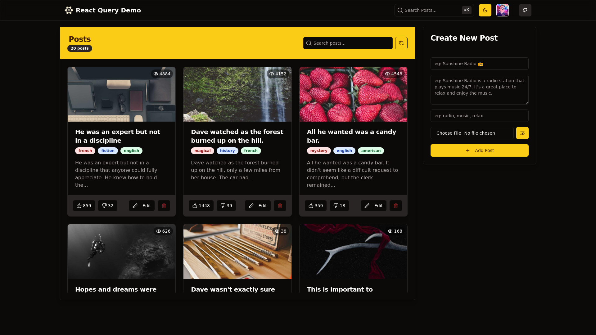

    updated on: 15th July 2025, Tuesday

<div align=center>
    <a href="https://github.com/warmachine028/react-query-demo">
        
    </a>
    <p style="font-family: roboto, calibri; font-size:12pt; font-style:italic"> A react query demo CRUD application using vite/shadcn </p>
    <a src="https://github.com/warmachine028/react-query-demo/forks">
        
    </a>
</div>

# [React Query Demo](https://github.com/warmachine028/react-query-demo)

![line]

## Table of Contents

- [Introduction](#introduction)
- [Installation](#installation-guide)
- [Tech Stack Used](#tech-stack-used)
- [Preview](#preview)
- [Best Contributors](#best-contributors)
- [License](#license)

![line]

## Introduction

- A Vite-based CRUD application utilizing React Query for efficient data fetching and management, supporting Create, Read, Update, and Delete operations.
- Styled with Shadcn, it features a responsive, clean UI ideal for dynamic data-driven applications.

![line]

## Installation Guide

  1. Download Bun
  2. Run the following commands for running client (frontEnd)
  3. set up `.env` with the help of `.env.example` file in client
```sh
$> cd client
$> bun i       # install all packages
$> bun dev # run the frontend
```
  3. Run the following commands for running server (backEnd)
```sh
$> cd server
$> bun i       # install all packages
$> bun dev   # run the backEnd
```

## Tech Stack Used
- **Frontend:** React, React Query
- **Styling:** Radix UI, Shadcn UI, TailwindCSS
- **State Management:** Zustand
- **Backend:** Elysia
- **Package Manager:** Bun
- **Deployment:** Vercel


 
  
  
 
![line]

## Preview

<picture align="center">
    <source media="(prefers-color-scheme: light)" srcset=".github/preview-light.png">
    <source media="(prefers-color-scheme: dark)" srcset=".github/preview-dark.png">
    
</picture>

![line]

## Best Contributors

<div align="center">
    <a href="https://github.com/warmachine028/react-query-demo/graphs/contributors">
        
    </a>
</div>

![line]

## License

- See [LICENSE]

**Pritam Kundu, 2024**

![line]

## Thank you, everyone 💚

[icons]: https://icons8.com
[markdown-badges]: https://github.com/Ileriayo/markdown-badges
[custom-icons]: https://simpleicons.org
[line]: https://user-images.githubusercontent.com/75939390/137615281-3a875960-92cc-407f-97fe-fd2319bdb252.png
[License]: https://github.com/warmachine028/react-query-demo/blob/main/LICENSE

<!-- 15/07/25 -->
